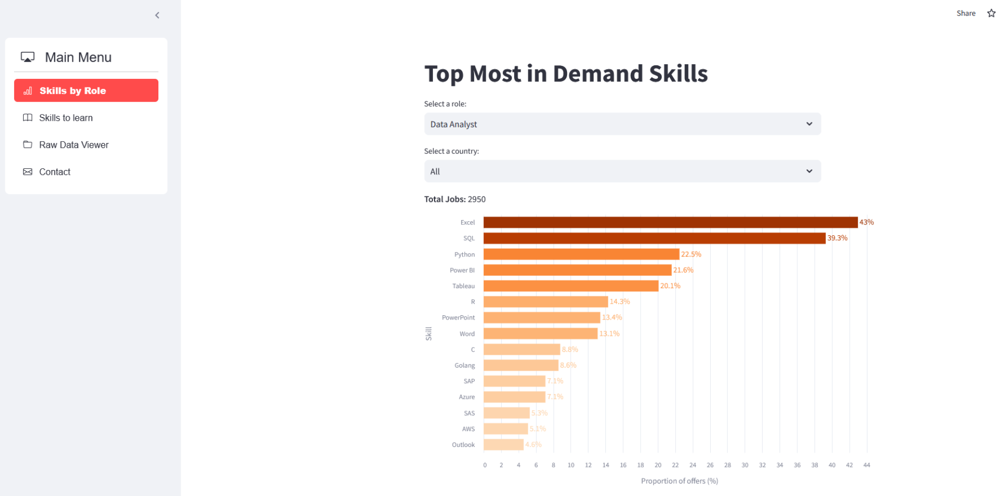

##  Data-Driven Value Creator 💎  
### Leveraging data into business opportunities 💰  

---

## 🚀 Main Projects  

### [💼 Tech Job Portal](https://github.com/juanludataanalyst/job_portal)

A smart job portal for the tech sector that uses AI and semantic search to recommend the most relevant job offers to each user.

🔗 **Live App**: [Tech Job Portal](https://jobsite.streamlit.app/ai_searching)  
🔗 **GitHub Repository**: [Tech Job Portal](https://github.com/juanludataanalyst/job_portal)

  

**Key Features**:

- **Semantic Search**: Find tech jobs using natural language and AI-powered matching.
- **AI Explanations**: Get clear, automatic explanations of why each job fits your profile.
- **Modern, Intuitive UI**: Built with Streamlit and custom CSS for a smooth user experience.
- **Easy to Use**: Just run and explore – no technical setup required!

**How It Works**

1️⃣ **Data Collector**: The portal loads and organizes job offer data from multiple sources, storing them in structured files for efficient access.

2️⃣ **Embeddings Generation**: Each job offer is converted into a high-dimensional vector using state-of-the-art language models (`sentence-transformers`). This allows the system to understand the meaning and context of each job description.

3️⃣ **Semantic Matching**: When a user enters a search query, it is also embedded into a vector. The system calculates the similarity between the user query and all job offers using cosine similarity, surfacing the most relevant results.

4️⃣ **AI-Powered Explanations**: For each search, the portal uses large language models (via Together AI) to generate clear, personalized explanations of why each job offer matches the user’s query.

5️⃣ **Interactive Experience**: All results and explanations are presented in a modern, interactive Streamlit interface, making it easy to explore opportunities and understand your best matches.

This project empowers tech professionals to discover new job opportunities and understand the reasoning behind each recommendation.

### [📊 Most In-Demand Skills App](https://github.com/juanludataanalyst/most_indemand_skills_streamlit_app)  

This web application helps professionals identify the most sought-after skills for different job roles across various countries. It also provides personalized recommendations on which skills to learn next based on user input, leveraging machine learning techniques and web scraping from multiple job portals.  

🔗 **Live App**: [Most In-Demand Skills App](https://mostindemandskills.streamlit.app/)  

🔗 **GitHub Repository**: [Most In-Demand Skills](https://github.com/juanludataanalyst/most_indemand_skills_streamlit_app)  

  

**Key Features**:  

- **Job Market Analysis**: The app gathers and processes job postings from various sources to extract the most frequently mentioned skills for different roles and regions.  
- **Smart Analysis & Personalized Recommendations**: Using machine learning algorithms, the app detects patterns and relationships between skills. Based on the user’s existing skill set, it suggests additional skills to enhance job market competitiveness.  
- **User-Friendly Interface**: Built with Streamlit, ensuring an intuitive and interactive experience.  

**How It Works**  

1️⃣ **Data Collection**: The app extracts job data from multiple job portals using web scraping and organizes it by date, country, and role.  
   ➝ [View code and explanation in my GitHub](https://github.com/juanludataanalyst/indeed_data_scraper_request)  

2️⃣ **Skill Extraction**: Relevant skills are identified from job descriptions and stored in a structured format.  

3️⃣ **Machine Learning Integration**: Association rule mining techniques uncover relationships between skills.  

4️⃣ **Recommendations**: Users enter their current skills, and the app suggests additional skills to learn, optimizing employability prospects.  

This tool is designed to assist job seekers and professionals in making data-driven decisions about skill development, ultimately improving their career opportunities.  

---

### [🏨 Data Pipeline for Hostal R10](https://github.com/juanludataanalyst/data_pipeline_hostalR10_py)  

A fully automated data pipeline for collecting and processing reservation data for Hostal R10, built with Python.  

🔗 **GitHub Repository**: [Data Pipeline Hostal R10](https://github.com/juanludataanalyst/data_pipeline_hostalR10_py)  

---

## 🎤 Talks  

📹 **[Tidyverse for Data Analysis - Sevilla R Users Group](https://www.youtube.com/watch?v=bKJsZl16Ifs)**  
A talk about using the `tidyverse` library in R for data analysis, presented at the Sevilla R Users Group.  

  

---

## 🛠 Tech Stack  

   
  &nbsp;&nbsp;&nbsp;&nbsp;
   
  &nbsp;&nbsp;&nbsp;&nbsp;
  
  &nbsp;&nbsp;&nbsp;&nbsp;
  

---

### 📫 Connect with me  

  

